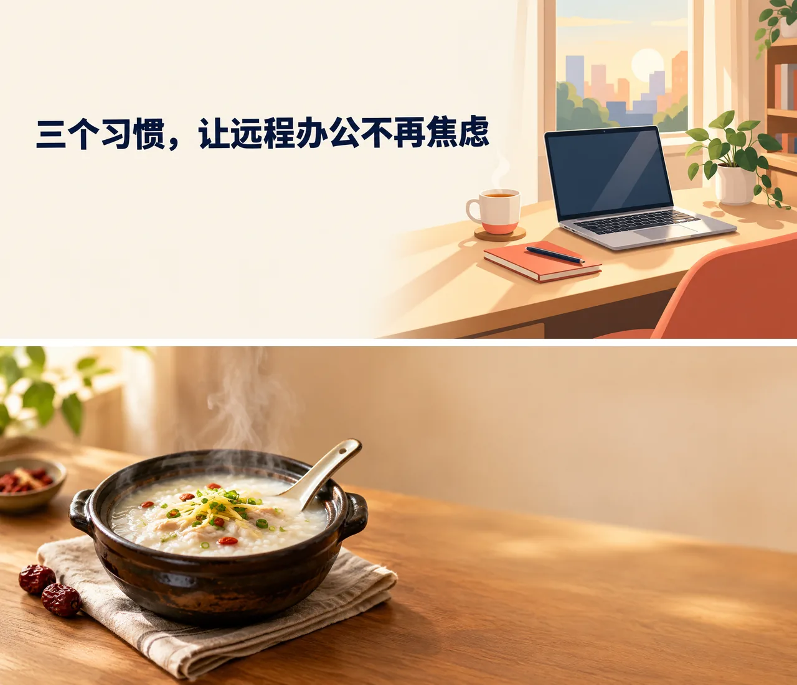

# 公众号封面生成 Skill

简体中文 | [English](./README.en.md)

输入文章标题、主题或参考图，生成公众号封面、推文首图和主题配图，支持标题入图、预留标题位置、品牌风格与构图精修，在 Claude Code、Codex 或 OpenClaw 里直接完成。

> [!IMPORTANT]
> 生成需要 [Beatra](https://beatra.ai) 账号并消耗积分，安装本身不收费。

| 问题 | 回答 |
| --- | --- |
| **能做什么** | 输入文章标题、主题或参考图，生成微信公众号封面图、文章首图、公众号头图、推文封面和主题配图，并支持标题入图、无字安全区、品牌风格与构图精修。 |
| **运行要求** | Python 3.10+，以及能加载 `SKILL.md` 的 Agent |
| **费用** | 安装免费。每次生成消耗 Beatra 账号积分，只有你明确要求这次生成或批准确认卡后才会付费。 |
| **支持的 Agent** | Claude Code、Codex、OpenClaw |

<p align="center"></p>

*两张 2.35:1 公众号文章封面：一张为远程办公文章绘制的扁平插画，图中直接生成标题「三个习惯，让远程办公不再焦虑」；另一张是砂锅粥美食摄影，不含文字，右侧留出干净的标题安全区。由 Beatra AI 生成。*

| Skill | Entry point | Version |
| --- | --- | --- |
| [`wechat-cover-maker`](skills/wechat-cover-maker) | [SKILL.md](skills/wechat-cover-maker/SKILL.md) | 0.2.2 |

本仓库由 [beatra-ai/beatra-skills](https://github.com/beatra-ai/beatra-skills/tree/main/skills/wechat-cover-maker) 自动发布，问题请到那里反馈。

## 安装

使用 [`skills`](https://skills.sh) CLI：

```bash
npx skills add beatra-ai/wechat-article-cover-skill
```

使用 GitHub CLI：

```bash
gh skill install beatra-ai/wechat-article-cover-skill wechat-cover-maker
```

也可以克隆本仓库，把 `skills/wechat-cover-maker` 复制到 `~/.claude/skills/`（Claude Code）、`~/.agents/skills/`（Codex）或 `~/.openclaw/skills/`（OpenClaw）。

或者把下面这段话发给你的 Agent：

```text
从 https://github.com/beatra-ai/wechat-article-cover-skill 安装 wechat-cover-maker skill（目录 skills/wechat-cover-maker），然后按它的 SKILL.md 连接我的 Beatra 账号。
```

## 效果示例

<p align="center"></p>

*同两篇文章配套的 1:1 分享缩略图：远程办公标题分两行排在书桌插画上方，砂锅粥则以近景特写呈现，小尺寸下依然清晰。由 Beatra AI 生成。*

提示词：

```text
[1] 微信公众号文章分享缩略图，正方形 1:1 构图，科技与效率主题的扁平插画风格，与同一篇文章的横版封面保持一致。画面下半部分：一张整洁的家中书桌，一台打开的笔记本电脑、一杯冒热气的茶、一盆小绿植，清晨柔和的暖色阳光。画面上半部分是干净的浅米白色背景留白，在其中居中用粗体黑体、深藏青色（#1F2A44）横排写出标题，分两行，文字必须逐字准确：第一行“三个习惯，”，第二行“让远程办公不再焦虑”。标题字大、醒目，四周留足边距，远离画面边缘。配色：米白、深藏青、柔和的珊瑚橙点缀。在很小的尺寸下依然清晰可辨。除这两行标题外，画面中不要出现任何其他文字、字母、数字、标志或水印；电脑屏幕上不显示文字。 ||| [2] Square 1:1 share thumbnail for a WeChat Official Account lifestyle article about cooking a warming autumn clay-pot congee at home, matching the article's wide editorial food photography cover. One focal subject, large and centered slightly low: a dark glazed clay pot of steaming creamy rice congee with shredded ginger, sliced scallions and a few goji berries, a ceramic spoon resting on the rim, gentle steam rising, on a warm oak table with a folded oatmeal linen napkin and two small dried red dates beside it. Soft natural window light from the left, shallow depth of field, warm amber, cream and muted terracotta palette. Clear bold silhouette that stays recognizable at very small thumbnail size; the upper quarter is a calm out-of-focus warm cream wall. Keep the pot fully inside the frame with margin from all edges. No text, no letters, no typography, no logos, no watermark.
```

## 你能得到什么

- **一篇文章，只提炼一个视觉钩子** — 从核心观点、冲突、人物、物件或隐喻中选出一个主角，避免多个概念互相争抢注意力。
- **先决定标题怎么出现** — 可以让短标题直接入图，也可以生成无字背景，为后续排版保留干净且有对比度的安全区。
- **保留方向，再聚焦精修** — 围绕焦点、层级、光影、颜色与品牌感继续调整，尽量保留已经确认的构图。

## 适用场景

- **深度文章与观点内容** — 为长文、访谈、评论和行业观察制作主题明确、缩略图中也容易识别的文章首图。
- **活动、上新与公告** — 为发布会、活动预告、产品更新和会员通知制作统一品牌感的公众号头图。
- **产品与服务解读** — 围绕一个产品、一项价值或一个变化组织画面，让读者快速理解文章重点。
- **固定栏目与系列内容** — 延续一致的色彩、构图和标题区策略，让连续推文保持可识别的栏目气质。

## 常见问题

### 制作公众号封面需要提供什么？

有文章标题或主题就可以开始。补充文章摘要、目标读者、视觉语气、发布尺寸、品牌色、Logo、商品或人物参考，会让方向更具体。

### 可以把文章标题直接放进封面吗？

可以。短标题可以按明确位置和对比度直接入图；如果字体与排版必须精准，也可以先做无字背景，为后续排版保留标题安全区。

### 能使用已有 Logo、商品图、人物或品牌参考吗？

可以。最多四张视觉参考可以分别用于主体、风格、人物或品牌方向，并会明确哪些细节需要尽量保留。

### 公众号爆款封面如何提升点击吸引力？

通过提炼文章核心钩子、强化缩略图识别度、建立清晰视觉层级，并让标题、人物、商品与品牌元素更贴合发布场景。

## 更新

安装后的 skill 每天最多检查一次新版本，替换前先校验官方归档，任何一步失败都不会动你已安装的版本。
随时可以关闭，见 skill 内的 `references/automatic-updates-and-safety.md`。

## 许可证

[MIT-0](LICENSE)：可自由使用、修改和再分发，包括商用，无需署名；与这些 skill 在 ClawHub 上的条款一致。
